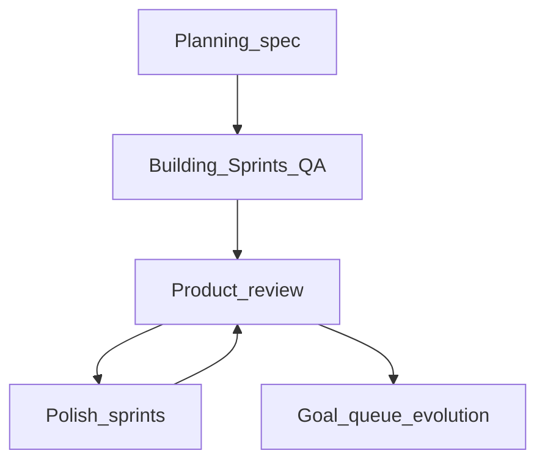

# harness-project

本仓库包含 **AI CLI 多阶段 Harness 编排**（脚本与模板）以及相关的长文设计/实践材料。

## Harness 能做什么

- **多 Epoch 编排**：在单次长跑中串联「规格 → Sprint 合同与实现 → QA → 产品评审 → Polish → 质量达标后的演进队列」，状态写入 `artifacts/harness-state.json`，支持 `--resume` 断点续跑。
- **双根路径**：业务与产物在 `WORK_ROOT`（本仓库 `harness-kimi` / `harness-codex` 或外仓 `$REPO/.harness`）；**Prompt 模板与 Playwright MCP 配置**始终来自 harness 包目录下的 `SCRIPT_DIR`（即 `harness-kimi/` 或 `harness-codex/` 内 `prompts/`、`config/`），不随外仓路径漂移。
- **外仓模式**：对任意 Git 仓库使用 `--project` / `HARNESS_PROJECT_ROOT`，在目标仓库下生成 `.harness/`，内含 `artifacts/` 与指向仓库根的 `project` 符号链接（见 [`harness-kimi/lib/workspace.sh`](harness-kimi/lib/workspace.sh)）。
- **现有代码库感知**：对外仓路径做轻量技术栈探测（`package.json`、Maven/Gradle、Python、Go、Rust 等），注入 Planner，引导在**既有栈上扩展**而非擅自换栈；Evaluator 使用探测得到的构建命令占位符（Maven/Gradle/npm 等）。
- **本地服务辅助**：[`restart-servers.sh`](harness-kimi/lib/restart-servers.sh) 可自动拉起常见后端（Python uvicorn、Spring Boot Maven/Gradle）与前端（在 `project/` 下最多两层查找 `package.json`，并按常见端口探测）；**未识别栈时需你在本机自行启动服务**。评测前会清理残留 Playwright/Chromium，减轻 MCP 死锁。
- **浏览器评测**：Evaluator / Reviewer 通过 Kimi/Codex 加载本目录 [`config/playwright-mcp-isolated.json`](harness-kimi/config/playwright-mcp-isolated.json) 调用 Playwright MCP。
- **运行产物不入库**：`harness-kimi/artifacts/` / `harness-codex/artifacts/` 下生成的 spec、合同、QA、截图、状态文件等由 [.gitignore](.gitignore) 忽略，仓库仅保留 `.gitkeep` 占位；外仓请在业务仓库中忽略 `.harness/`。
- **边界**：框架编排 AI CLI 与本地 dev server，**不替代** CI/CD、生产部署或全套集成测试矩阵。

### 三 Agent 架构

### 运行时概览（简化）

评审与 Polish 可能多轮循环，直至达到 `QUALITY_THRESHOLD` 或达到上限；细节以各 Harness 目录下的 `run-harness-full.sh` 与状态文件为准。

### 各阶段详解

#### 1. Planner —— 先把 Spec 写清楚

Planner 接收用户目标与现有技术栈摘要，产出完整的 `artifacts/spec.md`，将功能组织为 3 个核心 Sprint。

#### 2. Sprint Contract —— 先谈清楚什么算完成

每个 Sprint 开始前，Contract Agent 按 Sprint 内容生成合同草案，明确交付范围、验收标准与 Polish Criteria。

#### 3. Generator —— 按合同持续开发

Generator 依据合同实现代码，产出 `sprint-N-handoff.md`。若 QA 未通过，进入 Fix Round 修复。

#### 4. Evaluator —— 用 Playwright 真测

Evaluator 通过 Playwright MCP 在真实浏览器中操作应用，验证功能、回归与视觉质量，产出 QA 报告。

#### 5. Context 管理

长会话中通过状态文件、Artifacts 与 Prompt 渲染策略管理上下文，避免窗口溢出。

#### 6. Artifacts 与成本控制

所有产物（spec、合同、QA 报告、截图、状态）写入 `artifacts/`，不入版本库，支持 `--resume` 断点续跑。

### 实战总结

## 目录速览

| 路径 | 说明 |
|------|------|
| [`harness-kimi/`](harness-kimi/README.md) | **Kimi CLI 版本**主入口：`run-harness-full.sh`、`continue-harness.sh`、[`prompts/templates/`](harness-kimi/prompts/templates)、[`config/`](harness-kimi/config)（含 Playwright MCP） |
| [`harness-codex/`](harness-codex/README.md) | **Codex CLI 版本**主入口：完整移植 Kimi 版多 Epoch 架构，通过临时 `CODEX_HOME` 实现 MCP 动态隔离 |
| [`harness-design-guide.md`](harness-design-guide.md) | Harness 设计指南（精简版，便于快速查阅） |
| [`harness-practice-report.md`](harness-practice-report.md) | Multi-Agent Harness 工程实践长文（架构、Prompt 渲染、踩坑与优化） |
| [`harness-article-long-running-harness.md`](harness-article-long-running-harness.md) | 长时间运行 Harness 主题文章稿 |

本地跑通与参数说明请阅读对应 CLI 版本的 README：
- [`harness-kimi/README.md`](harness-kimi/README.md)
- [`harness-codex/README.md`](harness-codex/README.md)
